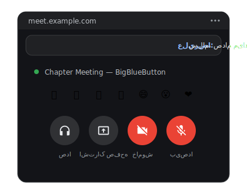

# BBB Floating Controls

Floating picture-in-picture controls for BigBlueButton meetings. Manage your microphone, camera, screen sharing and audio from any tab.

A Chrome extension for BigBlueButton — when you switch to another tab during a meeting, a small always-on-top floating window opens with full meeting controls: **microphone**, **camera**, **screen sharing**, **audio** and **reactions**.

  

## Motivation

BigBlueButton has a solid web client, but one frustrating gap in day-to-day use: **the moment you switch to another tab mid-meeting, you lose all visual connection to the meeting.**

- You can't tell whether your microphone is live — everyone has accidentally worked away with a hot mic at least once.
- A simple mute requires finding the meeting tab, switching to it, clicking the button, and switching back — right in the middle of whatever you were doing.
- If someone calls on you, it takes precious seconds to get back to the meeting.

Commercial meeting platforms solve this with an automatic floating window; BigBlueButton doesn't have one. This extension brings that experience to BBB: switch tabs and a compact always-on-top window appears in the bottom-right corner of your screen, giving you full meeting control right there.

## Features

- **Opens automatically** when you switch to another tab, and closes automatically when you return to the meeting tab
- Control your **microphone** (with mute-state indicator and the `M` keyboard shortcut), **camera**, **screen sharing** and **audio connection**
- **Send reactions** (✋ 👍 👎 👏 😄 😮 ❤️) straight from the floating window, via BBB's own reactions menu
- **Chat and reaction notifications:** chat messages and participant reactions (emoji, raised hands, etc.) appear as small toast cards at the top of the floating window and fade out automatically after a few seconds
- **Live video mirroring:** when a webcam or presentation is playing, it's shown inside the floating window; with no video, the window stays compact
- **Automatic return to the meeting tab** whenever an action needs a dialog — such as BBB's webcam settings modal or the browser's camera/screen permission prompt
- The floating window stays available while screen sharing. Note: when sharing a **tab or window**, the floating window never appears in the shared image; when sharing the **entire screen**, everything on the monitor — including this window — is captured (a browser limitation, not the extension's)
- Automatically positions itself in the **bottom-right corner** of the screen
- A manual launcher button on the BBB page itself (bottom-left)
- No special permissions — just a content script

## Installation

1. Open Chrome and go to `chrome://extensions`.
2. Enable **Developer mode** (top right).
3. Click **Load unpacked** and select this folder.

## Usage

- Join a BigBlueButton meeting. After a few seconds a round blue button appears at the bottom-left of the page — click it to open the floating window manually.
- **For automatic opening on tab switch,** Chrome needs permission:
  - Click the lock icon next to the BBB site's address → **Site settings** → set **Automatic picture-in-picture** to **Allow**.
- Inside the floating window, press `M` to toggle your microphone.
- Actions that require a dialog (turning on the camera, starting a screen share, joining audio) automatically take you back to the meeting tab so you can confirm there.

## Requirements

- Chrome **116+** (for Document Picture-in-Picture); automatic opening is supported from roughly version 120.
- BigBlueButton HTML5 client **2.4+** (buttons are located via `data-test` attributes).

## Technical notes

- The extension requests no special permissions and never talks to any external server; it's a single content script that activates only when it detects the BBB client.
- The floating window's buttons click BBB's real buttons (simulating the full pointer/mouse event sequence), so mute/camera state always stays in sync with the meeting itself.
- Automatic opening is implemented by registering an `enterpictureinpicture` handler with the MediaSession API; Chrome invokes it when a tab using the microphone/camera is hidden.
- Window size and position are continuously measured and corrected: Chrome sometimes silently ignores programmatic `resizeTo`/`moveTo` calls without a user gesture, so the extension verifies the actual geometry and retries until the window truly lands in the bottom-right corner — then leaves it alone so you can drag it wherever you like.
- Chat/reaction notifications come from a MutationObserver watching BBB's DOM (new chat list items, reaction elements, and BBB's own toast notifications), with safeguards against replaying old messages when the chat panel remounts.
